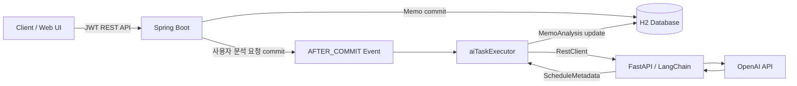
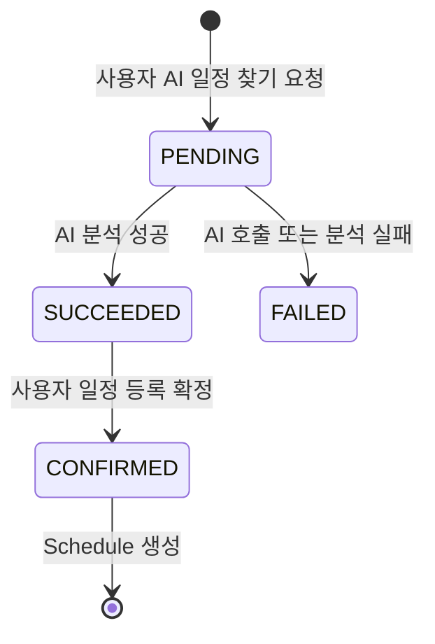

# DoQuest

> 오늘의 메모가 내일의 퀘스트가 되는 AI 기반 생산성 플랫폼

DoQuest는 사용자가 작성한 비정형 메모에서 일정 정보를 추출하고, 사용자 확인을 거쳐 캘린더 일정으로 전환하는 백엔드 프로젝트입니다. 퀘스트 수행과 펫 성장이라는 게이미피케이션을 결합해 기록에서 실행까지 이어지는 경험을 목표로 합니다.

이 프로젝트에서는 기능 수를 늘리는 것보다 다음 문제를 코드와 실험으로 검증하는 데 집중했습니다.

- 외부 LLM 호출이 핵심 메모 저장 트랜잭션을 지연시키거나 롤백시키지 않도록 격리
- AI 분석 결과를 즉시 영속화하지 않고 사용자가 확인한 뒤 일정으로 등록하는 Two-Phase UX
- KST 현재 시각을 기준으로 상대 날짜·시간을 해석하고, 시간이 없는 일정은 날짜만 유지
- JWT의 회원 식별자를 기준으로 모든 도메인 데이터의 소유권 검증
- 반복되는 일정 추천에 LLM을 사용하지 않고 인덱스 기반 쿼리로 처리
- 단위·슬라이스·트랜잭션 통합·실제 장애 실험을 통한 설계 근거 확보

## 핵심 성과

| 주제 | 구현 및 검증 결과 |
|---|---|
| 응답 지연 격리 | 평균 HTTP 응답 시간 `1,761.55ms → 9.46ms`, 약 `99.46%` 감소 |
| 트랜잭션 경계 | `AFTER_COMMIT` 이후에만 AI 작업을 실행해 롤백된 Memo의 AI 호출 방지 |
| 장애 격리 | FastAPI 종료 상태에서도 Memo 생성 `201 Created`, row 유지, `isParsed=false` 확인 |
| Two-Phase UX | AI 분석을 `PENDING → SUCCEEDED/FAILED → CONFIRMED` 상태로 관리하고 사용자 확정 후 Schedule 생성 |
| 중복 확정 방지 | 상태 검증과 낙관적 잠금으로 동일 분석 결과의 Schedule 중복 생성 방어 |
| 일정 조회 최적화 | `(member_id, scheduled_at)` 복합 인덱스로 월별 조회와 D-3 미완료 일정 조회 지원 |
| 날짜·시간 계약 | `scheduled_at(YYYY-MM-DD)`과 선택형 `scheduled_time(HH:mm)`을 분리해 FastAPI-Spring-React End-to-End 연동 |
| 테스트 | Spring 전체 `57 tests`, 실패 `0`, 오류 `0` |

성능 수치는 동일한 로컬 환경에서 실제 OpenAI E2E를 동기·비동기 각각 10회 측정한 상대 비교 결과입니다. LLM 추론 자체가 빨라진 것이 아니라 외부 I/O를 사용자 응답 경로에서 분리한 효과입니다.

자세한 실험 조건과 원시 측정값은 [동기·비동기 성능 및 장애 격리 검증](docs/ai-async-benchmark.md)에 기록했습니다.

### Two-Phase HTTP E2E 결과

2026-08-28 로컬 H2 환경에서 Spring Boot, FastAPI, OpenAI를 실제로 연결해 다음 흐름을 검증했습니다.

```text
Memo 생성(201)
→ 사용자 AI 일정 찾기 요청(202)
→ MemoAnalysis(PENDING)
→ AI 분석 완료(SUCCEEDED)
→ 사용자 확정(201)
→ MemoAnalysis(CONFIRMED)
→ 월간 Schedule 조회 반영
```

| 검증 항목 | 실제 결과 |
|---|---|
| FastAPI 상태 | `200 OK` |
| Memo 생성 | `201 Created`, memoId `1` |
| 분석 상태 전이 | `PENDING → PENDING → SUCCEEDED` |
| AI 추출 결과 | `2026-08-30`, 장소 `선릉` |
| Memo 파싱 상태 | `isParsed=true` |
| 사용자 확정 | `201 Created`, scheduleId `1` |
| 최종 분석 상태 | `CONFIRMED` |
| 월간 캘린더 조회 | 동일 memoId의 Schedule 1건 |
| 중복 확정 | `409 Conflict / MA003` |
| 확정 Memo 삭제 | `409 Conflict / MA004` |

자동 테스트뿐 아니라 실제 HTTP 요청에서도 AI 제안이 사용자 확인 전에는 Schedule로 저장되지 않고, 확정 이후 정확히 한 번만 등록되는 것을 확인했습니다. 상세 요청·응답과 추가 장애 시나리오는 [Two-Phase E2E 테스트 결과](docs/two-phase-e2e-test-results.md)에 기록했습니다.

## 아키텍처



### 메모 생성과 AI 후처리

```text
Transaction A
사용자의 분석 요청 + MemoAnalysis(PENDING) 생성
COMMIT
    ↓
@TransactionalEventListener(AFTER_COMMIT)
    ↓
@Async("aiTaskExecutor")
    ↓
FastAPI → LangChain LCEL → OpenAI Structured Output
    ↓
Transaction B (REQUIRES_NEW)
MemoAnalysis(SUCCEEDED/FAILED) + Memo.isParsed 갱신
```

- `AFTER_COMMIT`: 분석 요청 트랜잭션이 성공한 경우에만 AI 파이프라인 실행
- `@Async`: 외부 LLM I/O를 HTTP 요청 스레드에서 분리
- `REQUIRES_NEW`: AI 분석 결과를 독립 트랜잭션으로 반영
- AI 장애 시 Memo 원본은 유지되지만 현재 자동 retry/outbox/DLQ는 제공하지 않음

### Two-Phase 일정 등록



AI가 판단한 결과를 곧바로 Schedule로 저장하지 않습니다. 프론트엔드는 분석 결과를 조회한 뒤 사용자의 명시적 확정을 받아 Schedule을 생성합니다.

```http
POST /api/v1/memos/{memoId}/analysis
GET  /api/v1/memos/{memoId}/analysis
POST /api/v1/memos/{memoId}/analysis/confirm
```

확정 과정에서는 다음을 검증합니다.

- JWT 회원과 Memo 소유자가 일치하는가
- 분석 상태가 `SUCCEEDED`인가
- 실제 일정 후보이며 날짜가 존재하는가
- 이미 `CONFIRMED`된 결과가 아닌가
- 동시에 확정 요청이 들어와도 한 건만 생성되는가

## 주요 도메인

### Memo / MemoAnalysis / Schedule

- Memo 원문과 AI 분석 결과, 확정된 Schedule을 분리해 각 도메인의 책임을 명확히 유지
- AI 응답 계약: `is_schedule`, `title`, `scheduled_at`, `scheduled_time`, `location`, `summary_info`, `action_links`
- KST 기준 Temporal Grounding은 FastAPI에서 처리하고 Spring은 날짜를 `LocalDate`, 선택 시간을 `LocalTime`으로 검증·변환
- `scheduled_time`은 24시간제 `HH:mm` 또는 `null`이며, 시간이 언급되지 않은 마감 일정에는 임의 시간을 생성하지 않음
- 수동 일정과 Memo 기반 일정 생성 지원
- 월별 일정 및 D-3 미완료 일정 조회 지원

### Quest / Pet

- 퀘스트 보상 경험치를 클라이언트 입력에서 제외하고 서버 정책으로 관리
- `QuestStatus`를 상태의 단일 진실 공급원으로 사용
- 생성 직후 반복 완료로 경험치를 획득하지 못하도록 최소 30분 수행 시간 검증
- Member가 Pet의 생명주기를 관리하는 단방향 1:1 매핑으로 순환 의존 제거

### Dashboard

- Pet 상태와 진행 중 Quest를 하나의 `DashboardResponse`로 묶는 BFF/Aggregator API 제공
- 화면 진입 시 여러 API를 호출하는 대신 한 번의 요청으로 필요한 데이터 반환

## 기술 스택

| 영역 | 기술 |
|---|---|
| Backend | Java 17, Spring Boot 3.5.16, Spring MVC |
| Persistence | Spring Data JPA, Hibernate |
| Security | Spring Security 6, JJWT, Stateless JWT |
| Async / Integration | Spring Event, `@Async`, RestClient |
| Local Database | H2 In-Memory, MySQL compatibility mode |
| AI Service | FastAPI, LangChain LCEL, OpenAI Structured Output |
| Frontend MVP | React, TypeScript, Vite, Lucide |
| Testing | JUnit 5, AssertJ, Mockito, MockMvc, MockRestServiceServer |

현재 H2로 개발·검증 중이며 운영 DB는 아직 선정·연동하지 않았습니다. 운영 DB 선정 후 Flyway 또는 Liquibase 기반 마이그레이션과 실제 DB 통합 테스트를 추가할 예정입니다.

## Frontend MVP

`DoQuest-web`은 백엔드 API 계약과 Two-Phase 흐름을 실제 화면에서 검증하기 위한 React 기반 MVP입니다.

- 회원가입 및 JWT 로그인
- 월별 캘린더와 날짜별 일정 조회
- 일정 생성·수정·완료·삭제
- 수동 입력 시간과 AI가 추출한 시간을 캘린더 셀·날짜별 상세·분석 제안에 표시
- 메모장 단독 화면과 입력 중단 후 자동 저장
- 연속 입력·메모 전환 시 단일 저장 요청만 실행하고 저장 중 전환을 제한해 생성/수정 순서 보장
- 사용자 요청으로 AI 분석 시작 및 상태 자동 폴링
- AI 일정 제안 확인 후 Schedule 확정 및 캘린더 데이터 즉시 재조회
- 데스크톱·모바일 반응형 레이아웃

로컬 개발 서버는 `/api` 요청을 Spring Boot의 `localhost:8080`으로 프록시하므로 별도의 CORS 설정 없이 연동할 수 있습니다.

```bash
cd DoQuest-server
./gradlew bootRun

# 별도 터미널
cd DoQuest-web
npm install
npm run dev
```

브라우저에서 `http://localhost:5173`으로 접속합니다. AI 분석까지 확인하려면 FastAPI 서비스도 `localhost:8000`에서 실행해야 합니다.

## API 요약

모든 인증 필요 API는 `Authorization: Bearer <access-token>` 헤더를 사용합니다.

| 도메인 | Method | Endpoint | 설명 |
|---|---|---|---|
| Auth | POST | `/api/v1/auth/signup` | 회원가입 |
| Auth | POST | `/api/v1/auth/login` | 로그인 및 JWT 발급 |
| Dashboard | GET | `/api/v1/dashboard` | Pet + 진행 중 Quest 통합 조회 |
| Memo | POST | `/api/v1/memos` | Memo 생성 |
| Memo | GET | `/api/v1/memos` | 회원의 Memo 목록 조회 |
| Memo | PATCH | `/api/v1/memos/{memoId}` | Memo 수정 |
| Memo | DELETE | `/api/v1/memos/{memoId}` | Memo 삭제 |
| Analysis | POST | `/api/v1/memos/{memoId}/analysis` | 사용자 요청으로 비동기 AI 분석 시작 |
| Analysis | GET | `/api/v1/memos/{memoId}/analysis` | AI 분석 상태와 결과 조회 |
| Analysis | POST | `/api/v1/memos/{memoId}/analysis/confirm` | 분석 결과를 Schedule로 확정 |
| Quest | POST | `/api/v1/quests` | Quest 생성 |
| Schedule | POST | `/api/v1/schedules` | 수동/컨펌 Schedule 생성 |
| Schedule | GET | `/api/v1/schedules?year=2026&month=8` | 회원의 월별 Schedule 조회 |
| Schedule | GET | `/api/v1/schedules/curations` | D-3 미완료 Schedule 조회 |
| Schedule | GET | `/api/v1/schedules/{scheduleId}` | Schedule 단건 조회 |
| Schedule | PATCH | `/api/v1/schedules/{scheduleId}` | Schedule 제목·날짜·시간·장소·메모 수정 |
| Schedule | PATCH | `/api/v1/schedules/{scheduleId}/completion` | Schedule 완료 상태 변경 |
| Schedule | DELETE | `/api/v1/schedules/{scheduleId}` | Schedule 삭제 |

## 테스트 전략

| 계층 | 검증 대상 |
|---|---|
| Domain Unit | 팩토리 메서드, 상태 전이, 30분 수행 가드레일 |
| Service Unit | 회원 소유권, 분석 상태 전이, 중복 확정, DTO 변환 |
| MVC Slice | 요청 검증, 상태 코드, JSON 응답 계약 |
| RestClient Slice | 실제 FastAPI 연결 없이 요청·응답 DTO 계약 검증 |
| Transaction Integration | commit/rollback에 따른 `AFTER_COMMIT` 실행 여부 검증 |
| Failure E2E | FastAPI 프로세스 종료 시 Memo 보존과 장애 범위 확인 |

```bash
cd DoQuest-server
./gradlew test
```

현재 검증 결과:

```text
57 tests completed
0 failures
0 errors
```

## 실행 방법

### 1. 요구사항

- Java 17
- FastAPI AI 서버: `http://localhost:8000`

### 2. 로컬 설정

JWT 비밀키는 저장소에 커밋하지 않고 환경별 비밀 설정으로 관리합니다. 다음 값이 필요합니다.

```yaml
jwt:
  secret: replace-with-at-least-32-byte-secret
  access-token-expiration: 3600000
```

AI 서버 주소와 제한 시간은 `application.yml`의 `ai.service`에서 설정합니다.

### 3. Spring 실행

```bash
cd DoQuest-server
./gradlew bootRun
```

로컬 프로필은 H2 In-Memory DB를 사용합니다.

## 트러블슈팅 하이라이트

<details>
<summary><strong>외부 AI I/O로 인한 사용자 응답 지연</strong></summary>

- 동기 호출에서는 LLM 응답까지 요청 스레드가 대기
- `AFTER_COMMIT + @Async`로 외부 호출을 분석 요청 응답 경로에서 분리
- 평균 응답 시간 `1,761.55ms → 9.46ms` 확인
- AI 완료 시간은 별도 측정해 추론 성능 개선으로 오해하지 않도록 구분

</details>

<details>
<summary><strong>FastAPI 장애가 Memo 저장으로 전파되는 문제</strong></summary>

- Memo 트랜잭션과 AI 후처리 트랜잭션을 분리
- Mock 실패 테스트, 실제 트랜잭션 통합 테스트, FastAPI-down E2E를 각각 수행
- 외부 AI 장애 시 Memo row와 Spring 가용성 유지 확인
- 장애 격리는 구현했지만 자동 복구는 향후 과제로 명시

</details>

<details>
<summary><strong>Spring-FastAPI DTO 계약 불일치</strong></summary>

- Snake case JSON과 Java record 필드의 역직렬화 누락 확인
- `memo_id`, `scheduled_at`, `scheduled_time`, `location`, `summary_info`, `action_links` 계약 통일
- `@JsonProperty`와 Pydantic 스키마를 1:1로 맞추고 RestClient 슬라이스 테스트로 고정
- 시간은 FastAPI `HH:mm` → Spring `LocalTime` → React `scheduledTime`으로 전달하고 잘못된 형식은 서버에서 거부

</details>

<details>
<summary><strong>AI 결과의 무검증 자동 저장 위험</strong></summary>

- AI 결과를 곧바로 Schedule로 만들지 않고 `MemoAnalysis`에 제안 상태로 저장
- 사용자가 확인한 경우에만 Schedule 생성
- 소유권, 상태, 날짜, 중복 확정 및 동시 요청을 서버에서 검증

</details>

<details>
<summary><strong>메모 자동 저장 요청 경합과 연속 생성 오류</strong></summary>

- 입력 중단 자동 저장 중 새 메모를 연속 생성하거나 빠르게 전환하면 저장 effect가 서로 다른 Memo ID와 content를 참조하며 요청이 중첩
- 세 번째 메모부터 브라우저에서 `The string did not match the expected pattern` 오류가 발생하고 저장 상태가 불명확해지는 현상 재현
- `saveInFlight`로 동시 저장을 차단하고, 요청 시작 시점의 ID/content 스냅샷을 사용하도록 변경
- 저장되지 않은 변경이나 진행 중인 요청이 있으면 메모 전환·새 메모 생성을 잠가 순서를 보장
- UI의 저장 상태를 `saving / saved / error`로 분리하고 실패 시 다시 저장할 수 있도록 구성

</details>

<details>
<summary><strong>일정 확정 후 새로고침 전까지 캘린더가 갱신되지 않음</strong></summary>

- Schedule 생성 API는 성공했지만 프론트의 월간 일정 상태가 기존 배열을 유지해 화면에는 즉시 나타나지 않음
- 확정 성공 콜백에서 월간 Schedule과 Memo를 다시 조회하도록 캐시 무효화 지점을 명시
- AI 분석 결과는 상태 폴링, 일정 확정 결과는 즉시 재조회로 분리해 새로고침 의존 제거

</details>

## 메모 저장과 일정 등록 UX 결정

MVP에서는 “입력을 멈추면 모든 메모를 자동 분석·자동 등록”하는 방식과 “사용자가 버튼으로 AI 분석을 요청하고 확정”하는 방식을 비교했습니다.

자동 등록 방식은 입력 흐름이 빠르지만 모든 메모에 LLM 비용이 발생하고, 오탐 일정이 캘린더에 쌓이며, 메모 삭제 시 Schedule 연쇄 삭제 정책까지 즉시 결정해야 합니다. 반면 명시적 분석 방식은 한 번의 사용자 동작이 추가되지만 분석 의도가 분명하고 AI 제안을 등록 전에 검토할 수 있습니다.

따라서 현재는 다음 경계를 채택했습니다.

```text
메모 입력 중단 → Memo 자동 저장
사용자 ‘AI로 일정 찾기’ → 비동기 분석
AI 후보 자동 표시 → 사용자 확정 → Schedule 생성
```

- 메모 저장은 빠르고 예측 가능한 기본 기능으로 유지
- LLM 호출 시점을 사용자가 통제해 불필요한 호출과 비용 방지
- AI 오탐을 `MemoAnalysis` 제안 단계에서 차단
- 한 메모의 복수 일정 추출은 MVP 이후 후보 배열과 부분 확정 모델로 확장

## 로드맵

- [x] Spring 핵심 도메인과 JWT 인증
- [x] Memo-FastAPI 비동기 E2E
- [x] 동기·비동기 성능 비교 및 실제 장애 실험
- [x] Schedule 월별 조회와 D-3 큐레이션
- [x] AI 분석 저장·조회·사용자 확정 Two-Phase 흐름
- [x] Schedule 수정·단건 조회·완료 상태 API
- [x] 캘린더·메모장 단독 프론트와 메모 자동 저장
- [x] 명시적 AI 분석 시작과 결과 자동 폴링
- [x] 선택형 일정 시간 추출·저장·입력·캘린더 표시
- [x] 메모 자동 저장 요청 직렬화와 확정 후 캘린더 즉시 갱신
- [ ] 운영 DB 선정, 마이그레이션, 실제 DB 재검증
- [ ] 실패 AI 작업 retry/outbox 도입
- [ ] 펫과 퀘스트 단독 화면
- [ ] Vector DB 기반 유사 Quest 가드레일
- [ ] RAG, Docker Compose, CI/CD, 클라우드 배포

### 확장 계획

- 한 메모에서 여러 일정 후보를 배열로 추출
- 후보별 `PENDING / CONFIRMED / REJECTED` 상태와 부분 확정 지원
- 메모 수정 후 재분석 시 기존 확정 일정과 신규 후보의 충돌 정책 수립
- 반복 일정과 서로 다른 복수 일정의 구분
- 후보 단위 중복 확정 방지 및 멱등성 제약 추가

## 개발 기록

<details>
<summary><strong>Revision History</strong></summary>

| 날짜 | 주요 변경 |
|---|---|
| 2026.08.08 | Member, Pet, Quest 도메인 구축 |
| 2026.08.09 | Dashboard Aggregator API 설계 |
| 2026.08.10 | Quest 30분 수행 가드레일과 Pet 매핑 개선 |
| 2026.08.12 | Memo CRUD 및 record DTO 도입 |
| 2026.08.14 | Spring Security + Stateless JWT 구축 |
| 2026.08.19 | Spring RestClient와 FastAPI 계약 테스트 |
| 2026.08.20 | `AFTER_COMMIT + @Async` AI 파이프라인 구축 |
| 2026.08.25 | Schedule 도메인과 D-3 조회 구현 |
| 2026.08.28 | 성능·장애 실험 및 Two-Phase 분석 확정 흐름 구현 |
| 2026.08.28 | Two-Phase 정상 흐름·중복 확정·확정 Memo 삭제 HTTP E2E 검증 |
| 2026.08.29 | 캘린더·메모장 단독 화면, 자동 저장, 명시적 AI 분석 및 자동 폴링 구현 |
| 2026.08.31 | 메모 저장 직렬화, 확정 후 즉시 갱신, 선택형 일정 시간 필드 End-to-End 연동 |

</details>

---

이 저장소는 설계 선택의 이유와 검증 가능한 근거를 함께 남기는 것을 목표로 지속적으로 개선하고 있습니다.
